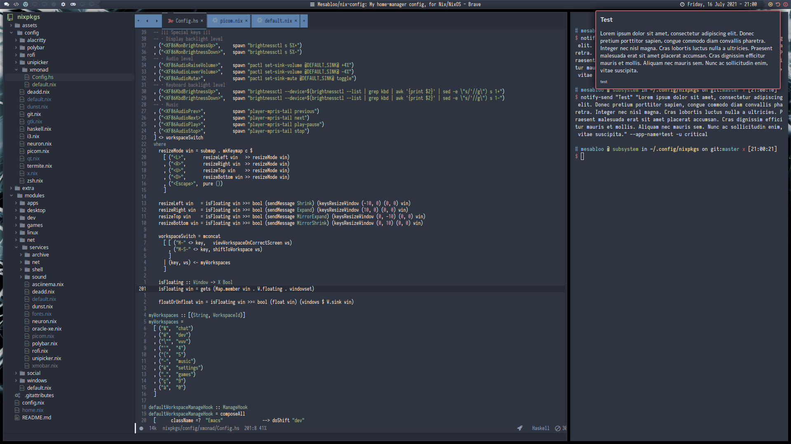
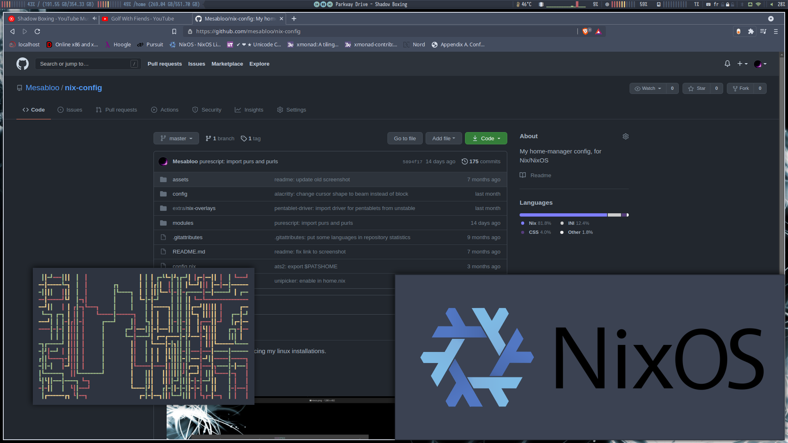

# My nix config

I usually don't take much time ricing my linux installations.

This one is an exception.

### Screenshots

##### Dual screen

- Left screen:
  
  
  - Left: emacs
  - Right: alacritty
  
- Right screen:
  
  
  - Bottom-left: pipes.sh
  - Bottom-right: nomacs
  - Middle: brave
