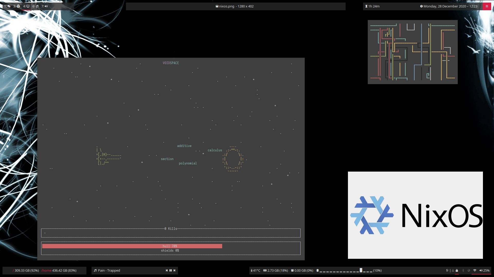

# My nix config

I usually don't take much time ricing my linux installations.

This one is an exception.

### Screenshots

- Top-right corner: [`pipes.sh`](https://github.com/pipeseroni/pipes.sh) running in alacritty
- Bottom-right corner: the NixOS logo viewed in nomacs
- Left border: [`void-space`](https://github.com/ChrisPenner/void-space), a terminal game written in Haskell where you have to type non-sense fast
